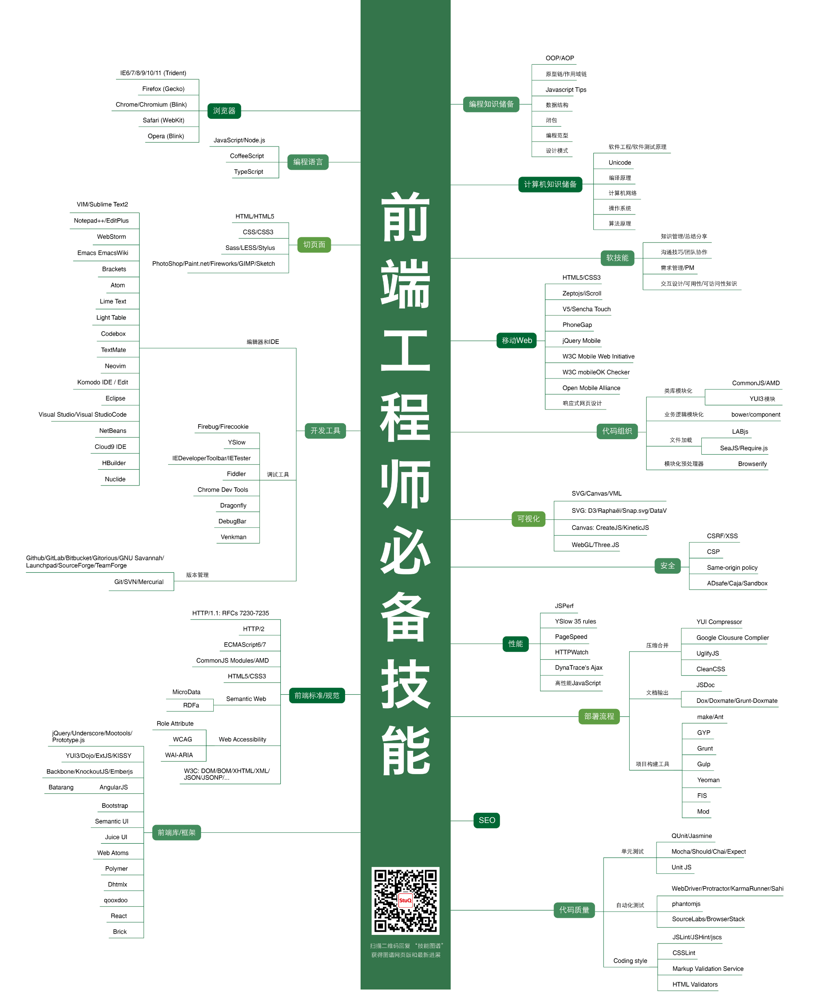
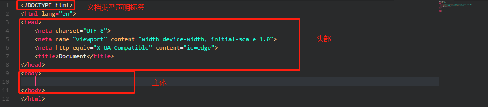

## 大前端之坑——第一章
#### 什么是前端工程师？
~~说实话，我也不知道~~
> Web前端工程师的职责是编写网页标准优化代码，并增加交互动态功能，开发JavaScript以及Flash模块，同时结合后台开发技术模拟整体效果，进行丰富互联网的Web开发，致力于通过技术改善用户体验。

**前端工程师并非简单的页面仔！**

#### 前端的“三板斧”
HTML（结构）、CSS（表现）、JavaScript（行为）  
需要遵循结构、表现、行为分离的原则。
###### 什么是web语义化？
简单的来说，web语义化就是为了能让机器读懂你的内容。

##### HTML/5(HyperText Markup Language) 超文本标记语言
之所以称为“超文本”，是因为页面可以包括图片、链接甚至音乐、视频等。

- DOCTYPE: 总是位于html文档的第一行，`<html>`标签之前，用来告诉浏览器文档是使用的哪个版本进行编写的。
- head标签: 用于定义文档的头部，描述了文档的各种属性和信息，告诉浏览器在哪里引用样式表、引用脚本等等。一般不在页面显示。
- body标签：用于定义文档的主体，一般在页面显示的内容全都包含在body标签内。

###### meta标签
> 元数据（metadata）是关于数据的信息。
标签提供关于 HTML 文档的元数据。元数据不会显示在页面上，但是对于机器是可读的。
典型的情况是，meta 元素被用于规定页面的描述、关键词、文档的作者、最后修改时间以及其他元数据。
标签始终位于 head 元素中。
元数据可用于浏览器（如何显示内容或重新加载页面），搜索引擎（关键词），或其他 web 服务。

###### 主流标签
1. 行内元素：不占据一整行，大小随内容而定，不可以设置宽高和行高，可以设置外边距但只对左右外边距有用，可以设置内边距。常见`<a>` `<b>` `` `<em>`等
2. 块级元素：占据一整行，可以设置宽高、行高以及内外边距，默认宽度总是与浏览器宽度一致与内容无关，可以容纳行内元素以及其他块级元素。常见`
` `<h1>` `<ul>`等
3. 行内块元素：不换行，可以设置宽高等。典型``

此外，标签还有成对标签和自闭合标签之分，成对标签中开始标签和闭合标签必须成对出现，如`

`。自闭合标签单个出现，如`` `<input>`就属于自闭合标签，需要注意的是，在H5中自闭合标签不推荐使用反斜杠，``这种形式的标签浏览器可能会识别为一个错误的开始标签。

###### HTML5
HTML5规范于2014年制定完成，是对超文本标记语言规范的第五次重大修改。
H5的新特性
- 更加丰富的语义化`<header>页面头部、<section>章节、<aside>边栏、<article>文档内容、<footer>页面底部、<section>章节、<aside>边栏、<article>文档内容、<footer>页面底部`
- 用于媒体回放的`<video>、<audio>`
- 更加多样化的表单`<datalist> ,<output> , <keygen>`
- 用于绘图的`<canvas>、<svg>`
- 对本地离线存储的更好的支持`localStorage` `sessionStorage` `indexedDB`
- 用于地理定位的` Geolocation API`

##### CSS(Cascading Style Sheets) 层叠样式表
css主要用来控制HTML文件样式。
###### css选择器
- 通用选择器
- 元素（类型）选择器
- 类选择器
- 属性选择器
- 伪类选择器
- ID 选择器

###### css优先级
（外部样式）External style sheet <（内部样式）Internal style sheet <（内联样式）Inline style

- 内联样式表的权值最高 1000。
- ID 选择器的权值为 100。
- Class 类选择器的权值为 10。
- HTML 标签（类型）选择器的权值为 1。

**优先级规则**
- 选择器都有一个权值，权值越大越优先。
- 当权值相等时，后出现的样式表设置要优于先出现的样式表设置。
- 创作者的规则高于浏览者：即网页编写者设置的CSS 样式的优先权高于浏览器所设置的样式。
- 继承的CSS 样式不如后来指定的CSS 样式
- 在同一组属性设置中标有“!important”规则的优先级最大。

###### css3
网页的样式遵从两个原则：`渐进增强`和`优雅降级`
- 渐进增强： 针对低版本浏览器先实现主要功能以及样式，在此基础上逐步针对高版本浏览器增强交互体验以及视觉效果。
- 优雅降级： 针对主流浏览器开发完善的功能及视觉效果，其次对低版本浏览器逐步降级兼容。