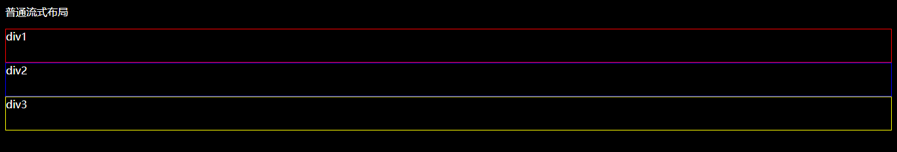
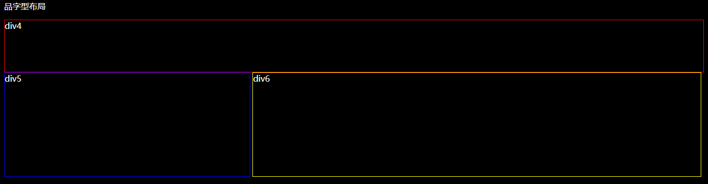
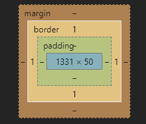

## 大前端之坑——第二章
### 如何将一张设计图转换成html页面？

通常情况下要将一张设计图转换成html页面(这里指静态页面，我们先省略动态交互效果等)，无外乎几个重点：合适的标签、布局、定位、盒模型、背景、字体等。下面我们来分别对应讲解。

##### 布局
当我们拿到一张设计图的时候，首先要做的事情就是分析页面的大体结构，大致确定每一块应该使用何种标签，从上至下分析每一块大概使用了何种布局（我们脱离前端UI框架来讨论），与此同时我们应该将响应式以及浏览器兼容性考虑在内（明确使用渐进增强还是优雅降级的原则）。
对于上下结构的页面，我们很好实现，因为块级元素默认换行并且渲染顺序按照自上而下的顺序

那么，如果我们想实现一个"品"字型布局呢，上面一个元素我们只要使用块级元素就可以搞定，重点在于下面两个并排的元素。我们之前讲过，行内元素是默认并排显示的，但是行内元素不能嵌套其余的行内或者块级元素，这对我们页面的实现很不友好，并且语义化的角度讲，我们也应该使用块级元素。我们之前还讲到，有一种元素具备了行内元素的特征以及块级元素的特征，那就是行内块级元素。我们可以通过`display`属性来改变元素的显示样式。

```
.class{
	display: inline-block;/*元素按照行内块级元素显示*/
}
```
该属性的一些常用属性（[更多属性](http://www.w3school.com.cn/jsref/prop_style_display.asp)）：
- inline 元素按照行内元素显示
- block 元素按照块级元素显示
- none 隐藏元素（元素不占据文档流空间）

使用该属性，我们可以很轻松的实现块级元素并排显示，但是需要注意的一点是，浏览器在处理行内块级元素的样式时，会将代码中标签之间的空格也渲染出来（标签换行也视作存在空格），这个空格约为`4px`。

此外，我们还有其他方法来实现两个元素并排显示。
1. ~~float方法~~
2. ~~table布局~~
3. flex弹性盒模型
4. grid栅格布局

我们着重介绍一下下面两种方法。
flex是弹性盒子的缩写，任何元素都可以设置为flex box，其语法如下
```
.class{
	display: flex; /*指定元素为flex元素*/
	display: inline-flex; /*指定行内元素为flex元素*/
}
```
我们可以看到，改变元素的显示方式依旧使用的是`display`这个属性，需要注意的是设为flex box以后，子元素的float、clear和vertical-align属性将失效。设置为`display: flex;`的元素我们称为“容器”，它还有以下的属性来控制显示方式：
```
.box {
  flex-direction: row | row-reverse | column | column-reverse; \*控制主轴方向*\
  flex-wrap: nowrap | wrap | wrap-reverse; \*控制元素是否换行以及换行方向*\
  flex-flow: <flex-direction> || <flex-wrap>; \*此属性是以上两个属性的简写*\
  justify-content: flex-start | flex-end | center | space-between | space-around; \*定义子元素在主轴上的对齐方式*\
  align-items: flex-start | flex-end | center | baseline | stretch; \*定义元素在交叉轴上的对齐方式*\
  align-content: flex-start | flex-end | center | space-between | space-around | stretch;\*定义多根轴线的对齐方式*\
}
```
介绍完了flex容器的属性设置，flex内部的子元素也有相应的样式：
```
.item{
	order: <integer>;\*用来设置子元素的排列顺序，数值越小越靠前，默认为0*\
	flex-grow: <number>;\*用来设置子元素的放大比例*\
	flex-shrink: <number>;\*用来设置子元素的缩小比例*\
	flex-basis: <length> | auto;\*定义在分配剩余空间之前，子元素所占的空间，可以设置成固定值*\
	flex: none | [ <'flex-grow'> <'flex-shrink'>? || <'flex-basis'> ] \*前面几个属性的缩写*\
	align-self: auto | flex-start | flex-end | center | baseline | stretch;\*可以设置单个子元素不同的对齐方式*\
}
```
关于grid栅格布局的相关只是，我们以后再作介绍。了解了上面两种布局的方法，基本上我们可以搞定80%的页面布局方式。

##### 盒模型
所有html元素都可以看成一个盒子，css中所提到的“盒模型”本质上就是一个盒子，它包括：外边距（margin）、边框（border）、内边距（padding）、内容（content）

```
.box{
	margin: 5px 5px 5px 5px; \*设置外边距，其顺序为上右下左*\
	margin-left: 5px;
	margin-right: 5px;
	margin-top: 5px;
	margin-bottom: 5px;
}
.box{
	pdding: 5px 5px 5px 5px; \*设置内边距，其顺序同样为上右下左*\
	pdding-left: 5px;
	pdding-right: 5px;
	pdding-top: 5px;
	pdding-bottom: 5px;
}
.box{
	border: 1px solid red;\*设置一个宽为1像素的实线红色边框*\
	border-width: 1px;
	border-style: solid;
	border-color: red;
}
```
其中，边框的样式还有
- dotted  定义点状边框。在大多数浏览器中呈现为实线。
- dashed  定义虚线。在大多数浏览器中呈现为实线。
- double  定义双线。双线的宽度等于 border-width 的值。
[更多边框样式](http://www.w3school.com.cn/cssref/pr_border.asp)、

另外，边框颜色接受十六进制颜色码以及rgba颜色码。

元素边框通常还会有三个属性用来设置以美化元素：
```
.box{
	border-radius: 2px;\*设置元素2px的圆角，接受值可为百分比*\
	box-shadow： h-shadow v-shadow blur spread color inset;\*值依次为水平阴影位置、垂直阴影位置、模糊距离、阴影尺寸、阴影颜色、内阴影*\
	border-image: url(xxx.png) 30 30 round;\*用于设置边框图片*\
}
```

##### 背景
`background`属性包含以下：
- background-color 背景颜色
- background-position 背景图像位置
- background-size 背景图像尺寸
- background-repeat 背景图像是否重复
- background-origin 背景图片的定位区域
- background-clip 背景图像的绘制区域
- background-attachment 背景图像是否固定
- background-image 规定要使用的背景图像
```
.box{
	background: #00FF00 url(bgimage.gif) no-repeat fixed top;
}
```

上面的值不必每个都去设置。

##### 字体
`font`属性包含以下：
- font-style 字体大小
- font-variant 字体异体
- font-weight 字体粗细
- font-size/line-height 字号和行高
- font-family 字体系列

字体属性的设置对我们使用的字体图标同样有效。此外，不是每个系统都能提供设计稿所包含的字体系列，例如在windows的操作系统中默认就没有苹果丽黑字体。那么我们该如何在所有用户的浏览器中保持字体一致性呢？我们可以使用css3提供的`@font-face`规则。
```
@font-face{
	font-family: myFont; \*定义字体的名称*\
	src: url('Sansation_Light.ttf'), \*字体文件的引用路径*\
		 url('Sansation_Light.eot');
}
```

##### 定位
除了常规的布局之外，有时候一些特殊的布局方式我们只通过更改元素的`display`是实现不了的，比如如何让一个元素浮在另一个元素上方？如何让一个元素始终处于窗口的最底部并且不随页面滚动？这时候我们就要用到元素的`position`属性。
在此之前，我们先说另外一个概念——文档流。
> 将窗体自上而下分成一行行, 并在每行中按从左至右的顺序排放元素,即为文档流.(自己的理解是从头到尾按照文档的顺序，该在什么位置就在什么位置，也可以按照上面的意思理解，自上而下，自左到右的顺序)

上面是一段摘自百度百科的描述，简而言之文档流就是自上而下从左往右的元素排列，每个元素都有自己的固定位置。那如何让一个元素显示在其他元素之上或者固定在某一个地方呢，这时候就要使这个元素脱离文档流。有理文档流的方式有两种：`position`和`float`。
这里我们详细介绍一下`position`属性，该属性的值分别有：
- static 元素出现在正常文档流中
- relative 相对定位，元素相对于其在文档流中的正常位置定位
- absolute 绝对定位，元素脱离文档流，相对于其父级第一个定位不为static的元素定位
- fixed 绝对定位，元素脱离文档流，相对于浏览器窗口进行定位

以上的属性都可以配合使用
```
.box{
	position: absolute | fixed;
	left: 20px;
	right: 20px;
	top: 20px;
	bottom: 20px;
}
```
此外定位元素还有一个`z-index`属性配合使用，这个属性表示元素的堆叠顺序，数值越大代表三维层面离用户越近，数值可以为负数。

**有了上面的一些基础知识之后，我们就可以书写一个静态页面了！**
另外提供一些教程了网站，大家可以去看看，有什么忘记的属性也可以进行查询
[W3School](http://www.w3school.com.cn/index.html)
[w3cplus](https://www.w3cplus.com/)
还有一个查询属性浏览器兼容性的网站
[Can I Use](https://caniuse.com/)

