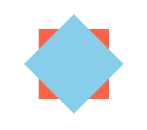
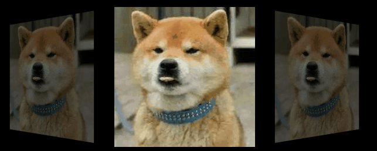
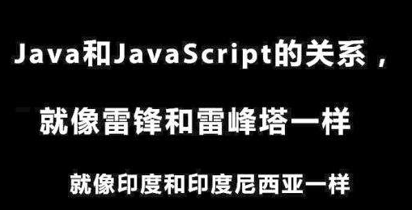

## 大前端之坑——第三章
### 怎么让你的网页动起来？

之前我们已经讲过怎么将一张设计图转换成一个html页面。但是不管是从设计师还是从用户的角度来讲，这样的静态页面远远不能满足需求，动的东西才跟具有吸引力。

那么，如何才能使一个网页上的元素动起来呢，总结来说有如下几点：
1. gif图或者flash动画  
早期的网页实现动画主要依靠的是gif或者flash动画。这个方法的优点在于浏览器兼容性问题低，且前端工程师的工作量较小；缺点是加载速度慢，影响用户体验，且维护成本高复用性差。而且随着新技术的兴起，两种方法已经逐步不采纳。
2. H5 canvas动画  
H5新增加了`<canvas>`画布，可以实现自由绘画功能，以及更高级的动画能力。这个方法的优点在动画自由度更高，浏览器兼容性问题低；缺点在于开发成本略高，所有动画效果都需要使用js来完成。
3. css3动画  
css3新增了动画能力，优点在于支持所有现代浏览器，并且开发成本低，易于实现且具有更高的动画性能。

今天，我们就来讲一讲css3的动画效果以及一些新的特性，css3有两个动画属性：`animation`和`transition`，下面我们来看一下两者的区别。

#### animation
`animation`属性强调流程与控制，它可以对元素的一个或多个属性进行控制，具有多个关键帧（与`@keyframes`结合）。`animation`是一个属性简写，可以分解成以下6个属性：
- animation-name 规定需要绑定到选择器的 keyframe 名称
- animation-duration 规定完成动画所花费的时间，以秒或毫秒计。
- animation-timing-function 规定动画的速度曲线。
- animation-delay 规定在动画开始之前的延迟。
- animation-iteration-count 规定动画应该播放的次数。
- animation-direction 规定是否应该轮流反向播放动画。

需要注意的是，`animation`属性需要联合`@keyframes`规则进行使用，`@keyframes`规则相当于事先定义好的一个流程或者说一组动画帧，它需要一个`name`。举个栗子：
```
.example{
	position: relative;
	animation: myAnimation 2s;
}
@keyframes myAnimation {
	from {
		left: 100px;
		width: 200px;
		height: 200px;
		background-color: lightseagreen;
	}
	to {
		left: 400px;
		width: 300px;
		height: 300px;
		background-color: mediumblue;
	}
}
```
效果图如下：

上面的代码我们定义了一组动画，从一开始的200*200像素逐渐变成300*300像素，同时我们改变了它的位置以及背景颜色，动画2秒执行完成。  
前面我们提到，`animation`属性是对流程的控制，所以我们定义一组动画的时候不仅可以使用`from` `to`来定义，还可以使用百分比来定义。这样能使我们的动画过程更加的丰富。再举个栗子：
```
.example{
	position: relative;
	width: 100px;
	height: 100px;
	animation: myAnimation 5s;
}
@keyframes myAnimation {
	0% {
		left: 100px;
		border-radius: 0;
		background-color: lightseagreen;
	}
	50% {
		left: 400px;
		border-radius: 50%;
		background-color: mediumblue;
	}
	100% {
		left: 800px;
		border-radius: 0;
		background-color: lightseagreen;
	}
}
```
效果图如下：

上面的代码跟之前我们稍有改动，我们使用了百分比来定义动画。在动画执行到50%的时候，我们将原本的正方形变成圆最后再更改回来。

这是`animation`最为基本的应用，当然`animation`还有更加厉害的动画能力，那就是`animation-timing-function`属性提供的`cubic-bezier (x1,y1,x2,y2)`三次贝塞尔曲线函数。贝塞尔曲线的数学基础是伯恩斯坦多项式，但是图像化应用最早是就职于雪铁龙的法国数学家Paul de Casteljau提出的`de Casteljau 算法`。后来由就职于雷诺的贝塞尔宣传而得名贝塞尔曲线。这里我们用到的是三次贝塞尔曲线，而贝塞尔曲面以及更加厉害的非均匀有理B样条已经成为了CAD的行业标准。


#### transition
与`animation`属性不同的是，`transition`属性强调的是元素的过渡，是元素的一个或多个属性变化时产生的过渡效果，同一个元素通过两种不同的途径获取样式，当样式发生改变时就会产生过渡效果，可以理解为`transition`有两个动画帧。其属性可分解如下：
- transition-property 规定设置过渡效果的 CSS 属性的名称
- transition-duration 规定完成过渡效果需要多少秒或毫秒
- transition-timing-function 规定速度效果的速度曲线
- transition-delay 定义过渡效果何时开始

需要注意的是，如果需要过渡效果，要始终设置`transition-duration`属性并且不能为0，否则不会产生过渡效果。举个栗子：
```
.example{
	position: relative;
	width: 100px;
	height: 100px;
	background-color: skyblue;
	border-radius: 0;
	transition: border-radius 1s;
}
.example:hover{
	border-radius: 50%;
}
```
效果图如下：

上面的代码实现的了当鼠标悬停到div上时，元素变为圆，鼠标悬停消失的时候，恢复成正方形。同样的，该属性也能使用三次贝塞尔曲线来绘制动画效果。


- - -
上面我们介绍了css3的两个动画属性，它们可以使我们的网页交互方式变得更为丰富。下面我们再介绍一个css3中非常有用且使用比较广泛的属性。
#### transform
正如字面所理解的那样，`transform`属性用来实现元素的变换或者说变形的。css3中所定义的变形分为：移位、缩放、旋转、倾斜。下面我们一个一个介绍:
##### translate(移位)
其语法如下
```
transform：translate(x, y);
```
其接受两个值，x轴平移距离和y轴平移距离。使用平移改变的元素不会挤动文档流中的其他元素。

#### scale（缩放）
其语法如下
```
transform：scale(x,y);
```
其接受两个值，x轴缩放比例和y轴缩放比例。

#### rotate(旋转)
其语法如下
```
transform： rotate(90deg);
```
其接受一个值，元素的旋转角度。

#### skew(倾斜)
其语法如下
```
transform: skew(x, y);
```
其接受两个值，x轴倾斜角度和y轴倾斜角度。

下面看一个综合的栗子：
```
div{
	display: inline-block;
	margin-left: 50px;
	margin-top: 50px;
}
.example1{
	transform: translate(20px, 0);
}
.example2{
	transform: scale(0.5, 0.5);
}
.example3{
	transform: rotate(45deg);
}
.example4{
	transform: skew(30deg, 15deg);
}
```
效果图如下：


#### transform-origin
此外，`transform`还有一个属性`transform-origin`，元素变换的原点默认是基于元素中心的，这个属性用来定义变换的原点。我们举个栗子看一下：
```
.wrap{
	position: relative;
	top: 200px;
	left: 500px;
	width: 100px;
	height: 100px;
	background-color: tomato;
}
.example5{
	width: 100px;
	height: 100px;
	background-color: skyblue;
	transform: rotate(45deg);
}
```
正常情况下，我们得到的结果是这样的：

我们可以发现，里面的正方形是以中心为原点旋转的。现在我们改变一下变换的原点：
```
.wrap{
	position: relative;
	top: 200px;
	left: 500px;
	width: 100px;
	height: 100px;
	background-color: tomato;
}
.example5{
	width: 100px;
	height: 100px;
	background-color: skyblue;
	transform: rotate(45deg);
	transform-origin: 0 0;
}
```
效果如下图：

我们将元素的变换原点设置成`0 0`,也就是说元素以`(0, 0)`这个坐标为原点进行旋转。

#### 3D变换
上面介绍的变换都是2D的，撇开倾斜变换之外，其他的变换具有3D变换的特点，下面我们接着看例子：
```
div{
	display: inline-block;
	margin-left: 50px;
	margin-top: 50px;
	border: 1px solid blue;
	perspective: 600px;
}
.example6 img{
	transform: rotateX(45deg);
}
.example7 img{
	transform: rotateY(45deg);
}
.example8 img{
	transform: rotateZ(45deg);
}
```
其效果如下图：

上面的代码我们分别定义了图片沿着X轴、Y轴、Z轴进行3D旋转，这里需要注意的是如果我们要使用3D旋转，必须在父元素或者祖先元素上设置`perspective`透视这个属性，否则浏览器会将3D变换的效果投射到2D层面，我们只能看到元素的宽度或者高度的改变。那么`perspective`这个属性是什么意思呢？它相当于浏览器模拟了一个观察者的角色，这个观察者跟Z轴是平行的，该属性的值定义观察者离被观察元素的距离。

一个综合实现的例子：
```
.example9 img{
	animation: myRotate 3s linear infinite;
}
@keyframes myRotate {
	0% {
		transform: rotateY(0deg);
	}
	50% {
		transform: rotateY(180deg);
	}
	100%{
		transform: rotateY(360deg);
	}
}
```


**利用css3动画及变换实现一个简单的相册效果**
```
body{
	background-color: #000;
}
.album{
	position: relative;
	margin-left: 100px;
	margin-top: 50px;
	width: 700px;
}
.album div{
	display: inline-block;
	margin-right: 30px;
	perspective: 600px;
}
.album div img{
	position: relative;
	transition: all 500ms linear;
}
.example10 img{
	transform: rotateY(-45deg);
	opacity: 0.4;
}
.example11 img{
	transform: scale(1.2);
}
.example12 img{
	transform: rotateY(45deg);
	opacity: 0.4;
}
.example13{
	position: absolute;
	right: 0;
	top: 0;
	z-index: -1;
}
.example13 img{
	transform: rotateY(90deg);
	opacity: 0;
}
.album:hover .example10 img{
	transform: rotateY(-90deg);
	opacity: 0;
}
.album:hover .example11 img{
	transform: translateX(-234px) rotateY(-45deg) scale(1);
	opacity: 0.4;
}
.album:hover .example12 img{
	transform: translateX(-249px) rotateY(0deg) scale(1.2);
	opacity: 1;
}
.album:hover .example13 img{
	transform: rotateY(45deg);
	opacity: 0.4;
}
```
实现效果如下图：



### 万恶之源——JavaScript
今天，我们先简单的介绍一下JavaScript的身世以及一些概念，更深层次的应用我们下节课的时候再具体介绍。  
早期的互联网页面只有静态页面而没有交互效果，诸如表单验证这种功能都是要服务器端处理完之后返回给浏览器，这在那个“刀耕火种”的年代是很致命的一件事情。到了1995年，Netscape公司决定在其开发的浏览器中搭载一门脚本语言，用来实现简单的动态交互效果，该脚本语言最初被命名为`LiveScript`，后来为了赶在发布日前夕完成工作，Netscape公司与Sun公司成立了一个开发联盟，最终发布的脚本语言为了蹭Java语言的热度，遂改名为`Javasript`。但其实`Java`与`JavaScript`之间没有半毛钱关系。后来，发生了很多故事，到1997年欧洲制造商协会开始着手制定一个JavaScript的标准，于是就有了后来的ECMA-262标准，也就是被称为`ECMAScript`的新的脚本语言标准。



#### DOM
> JavaScript最主要的操作对象毫无疑问是HTML文档，我们使用面向对象的方法来对文档内容进行抽象和概念化，以便于程序对其进行操作。这样的文档对象模型就是DOM（Document Object Model），本质上是一种应用程序接口（API）。
HTML文档的DOM结构和XML的DOM结构类似，都是一种树形结构。树的根节点就是document，然后有父节点、子节点、祖先、后代、兄弟节点这些关系。

#### BOM
> JavaScript除了要能操作文档，还需要能操作浏览器，比如获取浏览器窗口大小，或者刷新页面。和DOM类似，浏览器也提供了对象模型来支持JS的访问。这个模型就是BOM（Browser Object Model）。
BOM主要包含如下6个对象：
1. window对象，它是BOM的根对象，其它的BOM对象都是windows对象的属性
2. document对象表示浏览器中加载页面的文档对象，而这个对象也就是DOM模型的根对象
3. location对象包含了浏览器当前的URL信息
4. navigator对象包含了浏览器本身的信息
5. screen对象包含了客户端屏幕及渲染能力的信息
6. history对象包含了浏览器访问网页的历史信息。

js正因为可以操作`DOM`以及`BOM`的API，才使得网页具有了动态的特性。当然，ECAMSciprt与浏览器之间并不存在依赖关系，浏览器只是其可能的宿主环境之一。随着技术的不断发展，现在已经有像`Nodejs`这种可以跑在服务器端的js了。

要真正的理解js这么语言，我们要有一个**面向对象编程**的思想。万物皆对象，这个概念理解起来其实并不困难，我们先看一下比较专业的定义：
> 一切事物皆对象，通过面向对象的方式，将现实世界的事物抽象成对象。
> 把一组数据结构和处理它们的方法组成对象（object）。

这是什么意思呢，比如说你的对象，他/她这个人有名字、生日、血型等等信息，这些就是对象的属性；此外，他/她这个人还具有唱歌、画画、生孩子等等技能，这些就是对象的方法。那么把这些种种都集中在一起，就成了对象。然后我们再假设，有一天你的对象快生了，去医院医生问你对象的姓名、生日、血型这些信息，就相当于获取了对象的属性值，然后去产房生孩子这个过程，就相当于调用了对象的生孩子的这个方法，最后孩子就是return出来的结果。比照这个例子，你获取的一个`DOM`元素就相当于你的对象，你可以问它诸如`width`、`height`这些属性，或者调用它的像`appendChild()`、`removeChild()`这些方法。

同理，面向对象编程就相当于你自己用代码创造出这样一个“对象”，你可以定义它有哪些属性(信息)，有哪些方法(技能)。